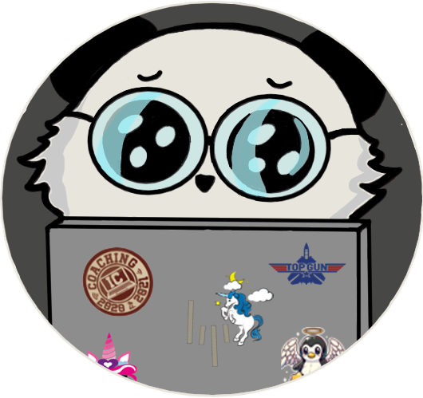

<h1>  Maxime Lestiboudois </h1>

## Who I am
I'm currently a student in Computer Sciences (Cybersecurity) at HEIG-VD, but I'm really interesting by software engineering. 

## My projects
### Scolar Projects:
Organizations:
- [PINut Butter](https://github.com/PIN-Groupe-4) 
This organisation was created to make the Summer course PIN (Projet d'Informatique/Computer Sciences Project) 2024.
- [La-Kirby-Team](https://github.com/La-Kirby-Team) 
La-Kirby-Team is an organization created to reunite all projects of the BDR (Bases de Données Relationnelles/Relationnal Databases) course. 
- [POO](https://github.com/POO-Lestiboudois-Parisod) 
This organization was created to reunite all Laboratories of POO (Programmation Orientée Objets/Objects Oriented Programming) course.
- [PCO](https://github.com/PCO24MaximeTristan) 
This organization was created to reunite all Laboratories of PCO (Programmation Concurrente/Concurrent Programming) course.

Repositories:
- [JaVelo](https://github.com/MaximeLesti/JaVelo)
JaVelo is a program that calculates routes and itineraries throughout Switzerland for bicycles. It was designed under the direction of Michel Schinz as part of the programming course at EPFL. The program is the result of a collaboration.
- [ISD_TP](https://github.com/MaximeLesti/ISD_TP)
This repository brings together all TP (Pratical Works) carried out for the ISD (Introduction to DataSciences) course 2023-2024 at HEIG-VD. All TPs are the result of a collaboration.
- [PRG-1](https://github.com/MaximeLesti/PRG-1)
This repository brings together all Pratical Works carried out for the ISD (Introduction to DataSciences) course 2023-2024 at HEIG-VD.
- [DAI-Project1](https://github.com/Nat004499/Dai-Project-1)
This repository contains the first DAI (Internet Application Development) project, the result of a collaboration
- [DAI-Project2](https://github.com/MaximeLesti/DAI-Project2)
This repository contains the second DAI (Internet Application Development) project, the result of a collaboration
- [PST](https://github.com/MaximeLesti/R-Project)
This repository was created to ensure project monitoring within the PST (Probabilties and Statistics) course 2024-2025 at HEIG-VD.

### Private Projects
Repositories:
- [CLICLAC]() 
This project consists to create an sowftware application to facilate the accounting of small business.
 

<h3 align="left">Languages and Tools:</h3>

 
  
  
  
  
   
 
  
   
  

